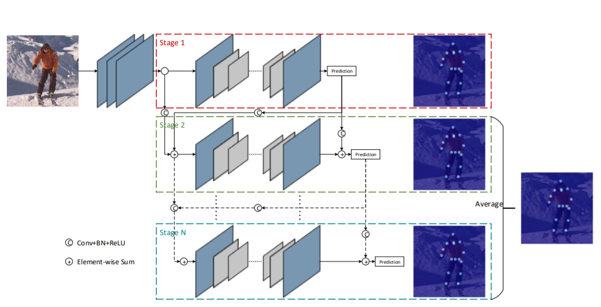
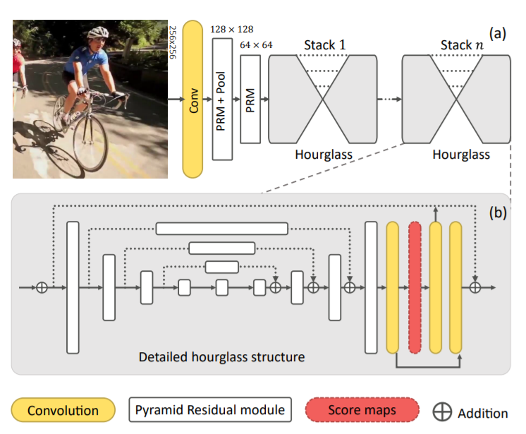
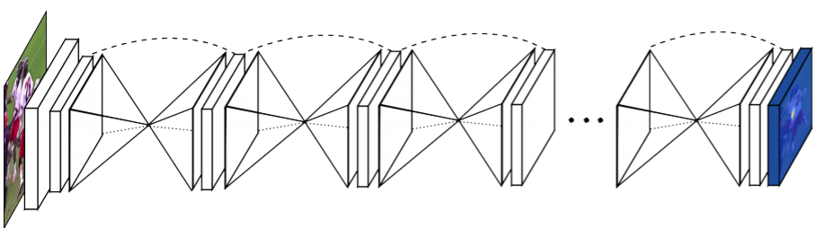
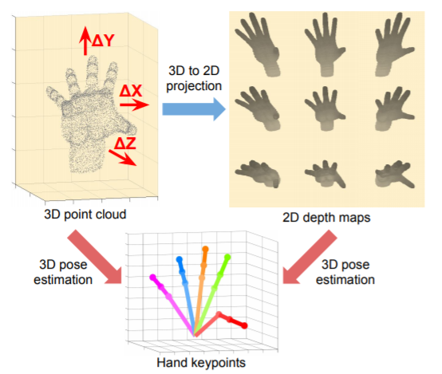
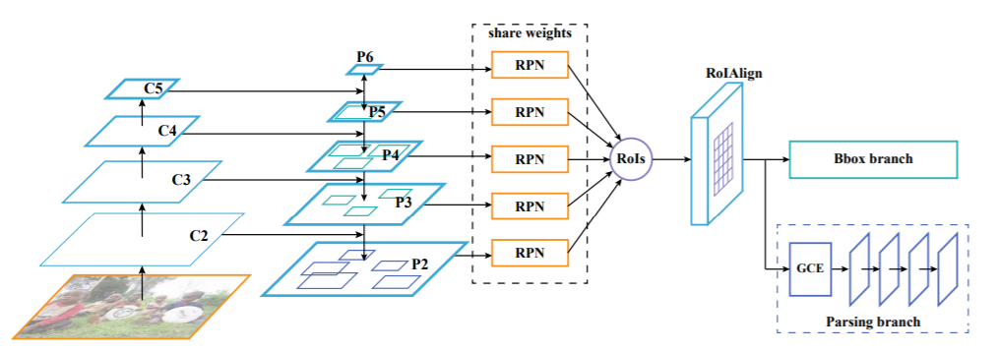
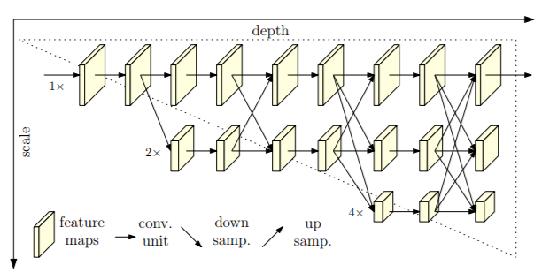
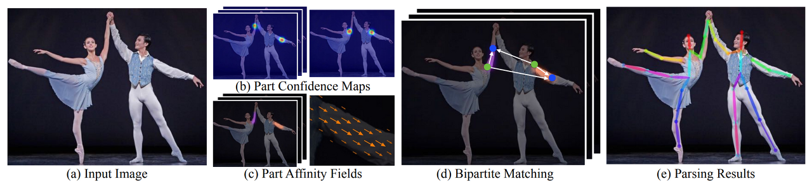

<h1> Pose Estimation</h1>

<h3>Pose Estimation</h3>
<li>  컴퓨터 비전에서 인간, 동물 등의 객체의 위치(Position)와 방향(Orientation)을 탐지하는 문제</li>
<li>사람의 신체 관절인 키포인트(Keypoint)의 위치를 측정(Localization)하고 추정(Estimation)하는 문제</li>
<li>평가지표: https://ctkim.tistory.com/101?category=906618, 추가 - </li>
--PCKh: 전체 프레임에서 사람의 스케일링이 변화되므로 머리 크기에 따라 적응적 임계값 적용
--MAP: Multi-person Pose Estimation의 평가지표로 사용

* 2D: x, y , 3D: x, y, z
* Top-down: 사람 인식 후 crop -> pose estimation
	* 정확도 높음
	* Detection 성능에 의존
	* 속도 느림 - 다중 객체 환경에서 특히
* Bottom-up: 영상에 포함된 사람의 키포인트를 모두 추정하고, 키포인트 간의 상관관계를 분석하여 포즈 추정
	* 빠름, 정확도 낮음

### Pose Estimation Datasets
* MPII Human Pose: http://human-pose.mpi-inf.mpg.de/
* Leeds Sports Poses: http://sam.johnson.io/research/lsp.html
* FLIC:  https://bensapp.github.io/flic-dataset.html, https://bensapp.github.io/flic-dataset.html
* ITOP:  https://www.alberthaque.com/projects/viewpoint_3d_pose/, https://www.alberthaque.com/projects/viewpoint_3d_pose/
*  DensePose-COCO: http://densepose.org/
*  COCO: http://cocodataset.org/

###State-of-the-art leaderboards
 
 MPII Human Pose

**Cascade Feature Aggregation for Human Pose Estimation**

* PCKh-0.5 : 93.9%
* Cascade Feature Aggregation (CFA) 제안
* 각 다른 스테이지에서의 Feature 들을 통합하여 풍부한 문맥정보를 얻음
* 서로 다른 스케일의 다양한 정보를 포착하기 위해 Hourglass model 을 Backbone 으로 사용
* Encoder와 Decoder의 Backbone은 ResNet model을 사용
* Partial Occlusion에 강건한 추정과 Keypoint Localization 정확도를 향상 시킬 수 있음
 

 

 

 Leeds Sports Poses

**Learning Feature Pyramids for Human Pose Estimation**

* PCK : 93.9%
* DCNN(Deep Coonvolutional Neural Network) 모델에서 Pyramid 를 학습
* DCNN의 스케일에서 불변성을 높이기 위해 PRM(Pyramid Residual Module)을 제안 =
* Multi-branch Network에서 서로 다른 서브샘플링 비율로 얻어진 입력 특징의 다양한 스케일에 Convolution Filter 를 적용하여 학습 
* Joint Location의 Score Map은 각 Hourglass 모듈의 끝부분에서 생성되며 Squared-error Loss 또한 각 Stack에 입력
 

FLIC Wrists

**Stacked Hourglass Networks : Stacked Hourglass Networks for Human Pose Estimation**

* PCK@0.2 : 97.0%
* 얼굴이나 손과 같은 Feature 들은 Local Evidence 가 중요
* 전체적인 포즈를 추정하기 위해서는 Full-body 를 이해하는 것이 필요
* 여러 스케일에 대한 정보를 포착하는 것이 중요
* 영상에서 모든 스케일에 대한 정보를 Downsampling의 과정에서 추출하고 이를 Upsampling 과정에 반영
* Pixel-wise output 생성, 이러한 과정을 반복하여 Stacked Hourglass Network 구조를 완성
 

 

 

 

 ITOP front-view, top-view

**V2V-PoseNet (Voxel-to Voxel Prediction Network for Accurate 3D Hand and Human Pose Estimation from a Single Depth Map)**

 

* Mean mAP : 88.74%
* 하나의 깊이 지도(Depth Map)에서 3차원 손과 인간의 자세를 추정하기 위한 기존의 딥러닝 기반 방법은 대부분 2차원 깊이 지도를 이용하여 손 또는 신체 관절과 같은 키포인트의 3차원 좌표를 직접 "회귀(Regression)" 하는 방법을 사용
* 이러한 접근법은 2차원 깊이 지도에서 원근의 왜곡이 존재
* 원근의 왜곡이란 예를 들어 3차원 실세계를 2차원으로 투영하여 영상을 생성하기 때문에 실제 객체의 모양에 대한 정보가 소실되는 문제점이 있고, 이를 다시 3차원으로 복원하려고 할 때 정보를 완벽하게 복원 하는데 한계가 있음
* 또한, 2차원 영상에서 3차원 좌표를 직접 회귀시키는 것은 2차원 좌표에 대응하는 3차원 좌표가 무한히 많기 때문에 정보가 매우 비선형적이므로 학습이 어려움
* 그래서 본 논문에서는 3차원 손과 인간의 포즈 추정 문제를 3차원 복셀화 된 그리드를 사용
* Voxel-to Voxel 방식으로 예측
* 각 키포인트에 대해 Voxel 당 Likelihood 를 추정
 

 

 

 

DensePose-COCO

**Parsing R-CNN for Instance-Level Human Analysis**

* AP : 61.6%
* Human Part Segmentation, Dense Pose, Human-object Interaction 분야에서는 인간의 Details 정보가 필요
* 영상에서 서로 다른 사람의 인스턴스를 구별하고 각 인스턴스의 세부 사항을 표현하는 것이 필요
* 본 논문은 Parsing R-CNN 이라는 인스턴스 수준의 인간 분석을 해결하기 위한 End-to-End 방법을 제안
* Region 기반 접근법의 특성과 인간의 외형을 종합적으로 고려하여 인스턴스의 세부사항을 표현
* Feature Semantic 정보를 향상 시키고, 해상도를 유지하기 위해 Separation Sampling 적용
* RolPool 연산은  많은 세부적인 특징들을 소실 시키기 때문에 Finest Level 에서만 수행
* 인스턴스의 다른 부분이나 밀도가 높은 부분을 구별하기 위해 Feature Map 해상도를 확대
* Receptive Field 를 확대하고 신체의 다른 부분들 사이의 관계를 파악하기 위해 기하학적 및 문맥 부호화 모듈 제안
* 높은 퀄리티의 Class-aware Mask 가 생성됨
* 높은 정확성과 작은 오버헤드를 갖는 적절한 브랜치를 구성함
* R-CNN을 Parsing 하는 것은 매우 효율적이기 때문에 많은 문제에 적용 시킬 수 있음
 

 

COCO

**HRNet-48 : Deep High-Resolution Representation Learning for Human Pose Estimation**

HRNet Network

(a) Hourglass, (b) Cascaded Pyramid Network, (c) SimpleBaseline, (d) HRNet

 

* Mean mAP : 77%
* 고 해상도의 인간 포즈 추정
* 기존의 방법은 고해상도에서 저해상도 네트워크에 의해 생성된 저해상도 표현으로부터 고해상도 표현을 복원
* HRNet 은 전체 프로세스를 통해 고해상도 표현을 유지
* 고해상도 서브 네트워크를 시작으로 점차적으로 고해상도와 저해상도 서브넷을 하나씩 추가하여 많은 스테이지를 생성하고 다중 해상도의 서브 네트워크를 병렬로 연결
* COCO 데이터 세트를 이용하여 벤치마크 한 결과 중 현재 제일 성능이 우수한 논문

**OpenPose**

* 문제점
	* 이미지 내에 몇명의 사람이 등장하는지 모름
	* 관절이나 팔다리가 가려질 수 있음
	* 처리시간

* 알고리즘
	*  이미지에서 Part Affinity Fields(PAFs)와 Part Confidence Maps(PCM) 검출하여 관절을 찾음
	* 찾아진 관절간의 관계성을 찾아 matching
	

	
* PCM
	* 관절의 위치에 대한 히트맵
	
* PAFs
	* 뼈에 대한 정보를 담고 있는 히트맵
	* vector로 표현됨
	* 여러 stage를 통해 정밀화
	* 관절의 주인 찾기

VGG 19에서 10 층만 사용 후 인풋 이미지의 feature 추출하여 PCM 취득 후 PAFs 취득

**
참고: https://reading-cv-paper.tistory.com/entry/TPAMI-OpenPose-Realtime-Multi-Person-2D-Pose-Estimation-using-Part-Affinity-Fields
참고: https://eehoeskrap.tistory.com/329 [Enough is not enough]